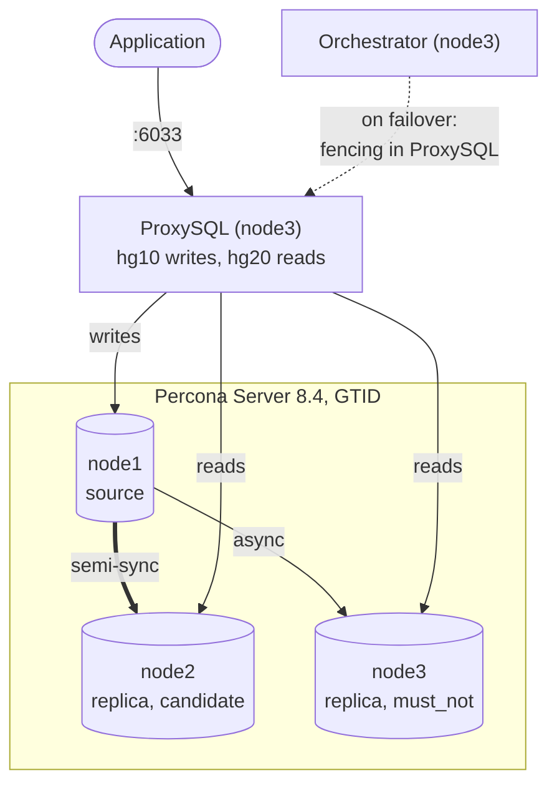
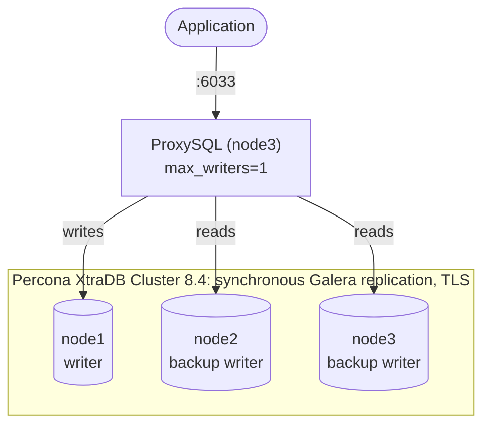

# ansible-mysql-percona-ha

[](https://github.com/Wergweth/ansible-mysql-percona-ha/actions/workflows/ci.yml)

An Ansible project that deploys one of two highly available MySQL variants based on Percona on three Ubuntu nodes:

| | Variant A - `semi-sync` | Variant B - `pxc` |
|---|---|---|
| DBMS | Percona Server 8.4 LTS | Percona XtraDB Cluster 8.4 LTS |
| Replication | asynchronous, GTID, semi-sync | synchronous (Galera), encrypted traffic |
| Topology | source + 2 replicas | 3 equal nodes |
| Routing | ProxySQL: writes to the source, reads from replicas | ProxySQL: single writer, the rest serve reads |
| Failover | Orchestrator + fencing of the failed source in ProxySQL | built into Galera, ProxySQL switches the writer |
| Monitoring | PMM 3, QAN from the extended slow log | PMM 3, QAN from the extended slow log |
| Run | `ansible-playbook playbooks/async.yml` | `ansible-playbook -i inventories/pxc.yml playbooks/pxc.yml` |

---

## Architecture

### Variant A



PMM Server (node3, Docker), pmm-client on all nodes.

### Variant B



---

## Requirements

**Nodes:**
- three Ubuntu 26.04 LTS or 24.04 LTS VMs, at least 2 vCPU and 4 GB RAM (node3 also runs PMM, ProxySQL and Orchestrator);
- a user with passwordless `sudo`, key-based login;
- ports between nodes for variant A: 3306;
- ports between nodes for variant B: 4444, 4567, 4568.

**Control machine**:

```bash
sudo apt install -y pipx
pipx install --include-deps ansible      # ansible-core 2.21
ansible-galaxy collection install -r requirements.yml
pipx inject --include-apps ansible ansible-lint yamllint
```

**Access from the nodes:** Ubuntu and Percona repositories, GitHub (ProxySQL package), 
Docker Hub (PMM Server image). If GitHub or Docker Hub are not reachable, put the files
into `artifacts/`, see [artifacts/README.md](artifacts/README.md).

---

## Quick start

**1. Access to the nodes**:

```bash
ssh-keygen -t ed25519                       # if there is no key yet
for ip in <ip> <ip> <ip>; do ssh-copy-id <user>@$ip; done
ssh-keyscan -t ed25519 <ip> <ip> <ip> >> ~/.ssh/known_hosts
```

On every node: `echo "<user> ALL=(ALL) NOPASSWD:ALL" | sudo tee /etc/sudoers.d/<user>`.

**2. Addresses and user.** 

Node addresses are kept in one place - `inventories/host_vars/node*.yml`,
the user - in `inventories/group_vars/all/main.yml` (`ansible_user`). 
The host mask for MySQL accounts is derived from the addresses automatically (`/24` of the first node).

**3. Secrets:**

```bash
cp vault.example.yml inventories/group_vars/all/vault.yml
vim inventories/group_vars/all/vault.yml           # passwords: openssl rand -hex 16
openssl rand -base64 32 > .vault_pass && chmod 600 .vault_pass
ansible-vault encrypt inventories/group_vars/all/vault.yml
```

Passwords - letters, digits, `-` and `_` only: they go into URLs, cnf files and SQL.
The playbook checks this as its first task and will not start with `CHANGE_ME` placeholders.

**4. Connectivity check and run:**

```bash
ansible all -m ansible.builtin.ping
ansible-playbook playbooks/async.yml                              # variant A
ansible-playbook -i inventories/pxc.yml playbooks/pxc.yml         # variant B
```

Partial runs - by tags: `os`, `mysql`, `replication`, `proxysql`, `orchestrator`, `pmm`.

**5. Test data**:

Both variants, through ProxySQL.
```bash
ansible-playbook playbooks/sysbench-prepare.yml
```

---

## Verification

```bash
# ProxySQL: who writes, who reads
# (for variant B add -i inventories/pxc.yml)
ansible proxysql -b -a proxysql-roles

# variant A: topology view via Orchestrator, web UI http://<node3>:3000
ansible orchestrator -b -a 'orc -c topology -i node1:3306'
ansible percona -b -m shell -a 'mysql -e "SHOW REPLICA STATUS\G" | grep -E "Source_Host|Running:"'
ansible source -b -a 'mysql -e "SHOW STATUS LIKE \"Rpl_semi_sync_source_%\""'

# variant B: cluster state
ansible pxc -i inventories/pxc.yml -b -m shell \
  -a 'mysql -e "SHOW STATUS WHERE Variable_name IN (\"wsrep_cluster_size\",\"wsrep_local_state_comment\")"'

# PMM: https://<node3>:8443, login admin, password from vault
```

---

## Structure

```
├── ansible.cfg
├── requirements.yml               collections with version ranges
├── vault.example.yml              secrets template (the real vault never goes into git)
├── inventories/
│   ├── async.yml                  variant A: node roles only
│   ├── pxc.yml                    variant B: node roles only
│   ├── host_vars/node*.yml        node identity: address, server_id
│   └── group_vars/
│       ├── all/main.yml           connection, PMM, ProxySQL
│       ├── all/mysql.yml          common mysqld settings for both variants
│       ├── all/users.yml          MySQL accounts and grants
│       ├── percona.yml            variant A: replication, semi-sync
│       └── pxc.yml                variant B: cluster
├── playbooks/
│   ├── async.yml
│   ├── pxc.yml
│   └── sysbench-prepare.yml
├── roles/
└── artifacts/                     large files kept out of git (see the README inside)
```

| Role | Variant | What it does |
|---|---|---|
| `common` | both | hostname, `/etc/hosts` from the inventory, sysctl, swap, THP disabled, mysqld limits |
| `percona_repo` | both | `percona-release`, main and extra Percona repositories |
| `percona_server` | A | packages, `my.cnf`, service |
| `percona_replication` | A | source: open writes and semi-sync; replicas: `CHANGE REPLICATION SOURCE` with GTID |
| `mysql_objects` | both | databases, users, grants - on one node, replication delivers them to the rest |
| `percona_cluster` | B | packages, CA and certificates, `my.cnf`, bootstrap, nodes join one at a time |
| `proxysql` | both | installation, `replication` or `galera` mode, R/W routing |
| `orchestrator` | A | package from `pdps-84-lts`, systemd unit, config, fencing hook, `orc` wrapper |
| `pmm_server` | both | Docker, image (from an archive or Docker Hub), PMM 3 container |
| `pmm_client` | both | agent, registration, MySQL service with QAN from the slow log |

## Operations

- After a failover (variant A), move the nodes between the `source`/`replica` groups in `inventories/async.yml`:
  the playbook checks the inventory against the actual topology and stops on a mismatch.
- The former source is brought back manually after the incident is investigated: `orc -c end-downtime`
  and the `ONLINE` status in ProxySQL (the hook set it to `OFFLINE_HARD`).
- After all nodes are stopped, PXC is brought up from the node with `safe_to_bootstrap: 1` in `/var/lib/mysql/grastate.dat`.
- Switching between variants - only on clean VMs: Percona Server and PXC packages conflict.
